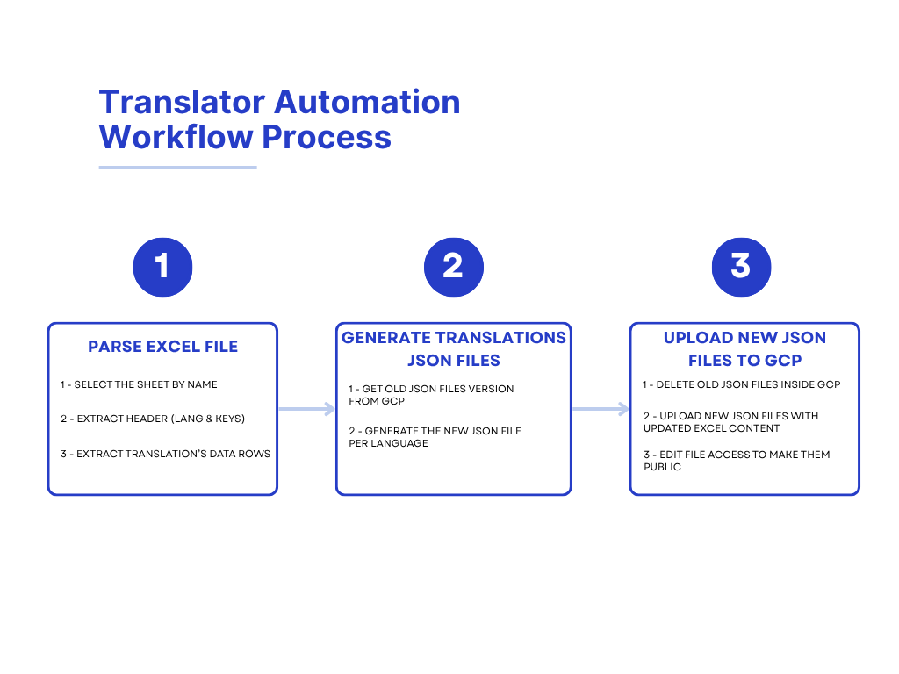

# 🌍 🔣 Translator Automation Pipeline

🎥 **Demo Video:** [Watch here](https://youtu.be/VYTFT205AT0)

This Dart CLI tool automates the process of reading translations from an Excel sheet and publishing them as versioned JSON files to **Google Cloud Storage**.

---

## 🚀 Features

- ✅ Parses an Excel sheet containing multilingual translations
- ✅ Extracts keys and localized values
- ✅ Generates formatted JSON translation files for:
  - French 🇫🇷
  - English 🇬🇧
  - Spanish 🇪🇸
  - German 🇩🇪
  - Portuguese 🇵🇹
  - Dutch 🇳🇱
  - Italian 🇮🇹
- ✅ Automatically versions files based on GCS contents
- ✅ Uploads them to a GCS bucket and makes them public
- ✅ Deletes old JSONs from cloud + local
- ✅ Clean, step-by-step logs for easy monitoring

---

## 📊 Excel Sheet Format

Below is an example of the expected Excel format used for translation input:


## 🔣 Translator Automation Workflow Process

Below is the translator automation workflow process:



---

## 🛠️ Setup

### 1. Clone the repo
> 💡 Don't forget to download and add the `service_account.json` file from GCS (Google Cloud Storage)

```bash
git clone https://github.com/MohammedAmineDridi/translator_workflow_automation.git
cd translator_automation
dart pub get
dart run